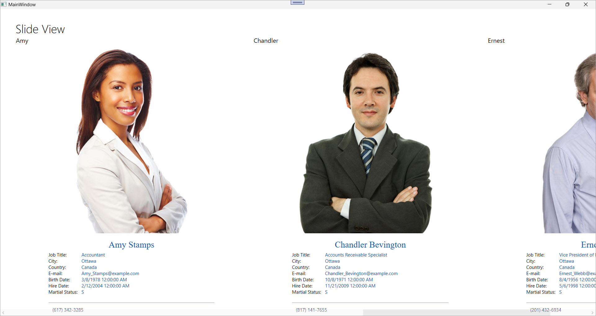

<!-- default badges list -->

[](https://supportcenter.devexpress.com/ticket/details/E4648)
[](https://docs.devexpress.com/GeneralInformation/403183)
[](#does-this-example-address-your-development-requirementsobjectives)
<!-- default badges end -->

# WPF SlideView – Display a Horizontal List of Cards with Swipe Navigation

This example uses the [`SlideView`](https://docs.devexpress.com/WPF/DevExpress.Xpf.WindowsUI.SlideView) control to display a scrollable horizontal list of items. Each item is rendered as a content card with user-defined templates.



Use the [`SlideView`](https://docs.devexpress.com/WPF/DevExpress.Xpf.WindowsUI.SlideView) control when you need to:

- Display detailed information for data items in a focused, single-item view.
- Create a modern, user-friendly interface with swipe-style navigation.

## Implementation Details

### Data Structure

The data source contains a list of `Employee` objects, which is exposed by the `EmployeesData` view model through the `DataSource` property. The `Employee` class exposes employee-related properties (such as `FullName`, `Photo`, `JobTitle`, `EmailAddress`, and `City`). Images are stored as byte arrays and converted to BitmapImage objects at runtime.

```csharp
public class Employee {
    public string FirstName { get; set; }
    public string LastName { get; set; }
    public string FullName => FirstName + " " + LastName;
    public string JobTitle { get; set; }
    public string EmailAddress { get; set; }
    public string City { get; set; }
    public byte[] ImageData { get; set; }

    [XmlIgnore]
    public BitmapImage Photo => imageSource ??= LoadImage();

    BitmapImage LoadImage() {
        var stream = new MemoryStream(ImageData);
        var image = new BitmapImage();
        image.BeginInit();
        image.StreamSource = stream;
        image.EndInit();
        return image;
    }
}
```

### Templates

The following code example defines two templates:

* [`ItemHeaderTemplate`](https://docs.devexpress.com/WPF/DevExpress.Xpf.WindowsUI.SlideView.ItemHeaderTemplate) displays the employee’s first name.
* [`ItemContentTemplate`](https://docs.devexpress.com/WPF/DevExpress.Xpf.Docking.LayoutGroup.ItemContentTemplate) displays detailed information, including photo, contact details, and job data.

```xaml
<DataTemplate x:Key="ItemHeaderTemplate">
    <TextBlock Text="{Binding FirstName}" />
</DataTemplate>

<DataTemplate x:Key="ItemContentTemplate">
    <Grid>
        <!-- Photo, FullName, JobTitle, etc. -->
    </Grid>
</DataTemplate>
```

### Slide View Configuration

```xaml
<dxwui:SlideView
    Header="Slide View"
    ItemsSource="{Binding DataSource}"
    ItemHeaderTemplate="{StaticResource ItemHeaderTemplate}"
    ItemTemplate="{StaticResource ItemContentTemplate}" />
```

## Files to Review

* [DataStorage.cs](./CS/SlideViewSample/DataStorage.cs)
* [MainWindow.xaml](./CS/SlideViewSample/MainWindow.xaml)

## Documentation

* [SlideView](https://docs.devexpress.com/WPF/DevExpress.Xpf.WindowsUI.SlideView)
* [SlideViewItem](https://docs.devexpress.com/WPF/DevExpress.Xpf.WindowsUI.SlideViewItem)
* [ItemHeaderTemplate](https://docs.devexpress.com/WPF/DevExpress.Xpf.WindowsUI.SlideView.ItemHeaderTemplate)
* [ItemContentTemplate](https://docs.devexpress.com/WPF/DevExpress.Xpf.WindowsUI.SlideView.ItemHeaderTemplate)
* [Slide View](https://docs.devexpress.com/WPF/15020/controls-and-libraries/windows-modern-ui/content-containers/slide-view)

## More Examples

* [WPF Accordion Control – Bind to Hierarchical Data Structure](https://github.com/DevExpress-Examples/wpf-accordion-bind-to-hierarchical-data-structure)
* [WPF MVVM Framework – Use View Models Generated at Compile Time](https://github.com/DevExpress-Examples/wpf-mvvm-framework-view-model-generator)
* [WPF Dock Layout Manager - Populate a DockLayoutManager LayoutGroup with the ViewModels Collection](https://github.com/DevExpress-Examples/wpf-docklayoutmanager-display-viewmodels-collection-in-layoutgroup)
* [WPF Bars – Create a Container for BarItem Links](https://github.com/DevExpress-Examples/wpf-bars-create-baritem-link-container)
* [WPF PDF Viewer – Customize the Integrated Bar's Commands](https://github.com/DevExpress-Examples/wpf-pdf-viewer-customize-bar-manager)

<!-- feedback -->
## Does this example address your development requirements/objectives?

[](https://www.devexpress.com/support/examples/survey.xml?utm_source=github&utm_campaign=create-wpf-slide-view&~~~was_helpful=yes) [](https://www.devexpress.com/support/examples/survey.xml?utm_source=github&utm_campaign=create-wpf-slide-view&~~~was_helpful=no)

(you will be redirected to DevExpress.com to submit your response)
<!-- feedback end -->
